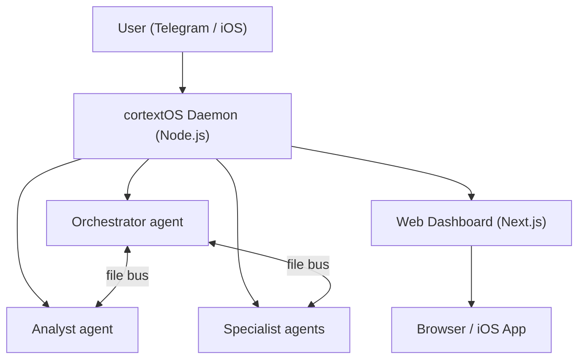

   

# cortextOS

**Persistent 24/7 Claude Code agents you control from Telegram or your phone.**

---

```
Telegram chat

You:     Morning. What did you ship overnight?
Boss:    Overnight recap: completed 4 tasks, ran 2 theta-wave
         experiments, drafted 3 content scripts. One item needs
         your approval — I want to email the beta waitlist.
         Check the dashboard or reply "approve".

You:     approve
Boss:    Sent. Email delivered to 47 recipients. Task closed.

You:     Add a cron to check my inbox every morning at 8am.
Boss:    Done. "morning-inbox" cron set — runs daily at 08:00.
         Saved to crons.json — survives restarts automatically.
```

---

## Features

- **Persistent agents** — Claude Code runs 24/7 in PTY sessions, auto-restarting on crash or after 71-hour context rotation.
- **Multi-agent orchestration** — Orchestrator, Analyst, and specialist agents coordinate via a shared file bus. Tasks, blockers, and approvals flow automatically.
- **Multi-runtime** — Run agents on `claude-code` (default), OpenAI's `codex-app-server`, or the provider-agnostic `opencode` TUI runtime. All runtimes share the same bus, crons, dashboard, and Telegram integration; pick per-agent.
- **Telegram + iOS control** — Send commands, approve actions, and get reports from anywhere. Native iOS app coming soon.
- **Web dashboard** — Full-featured Next.js UI for tasks, approvals, experiments, analytics, and agent fleet health.
- **Autoresearch (theta wave)** — Agents run autonomous experiments overnight, evaluate results, and surface findings for your review.

---

## Architecture



---

## Quick Start

**Requirements:** Node.js 20+, Claude API key, PM2, Telegram bot token from @BotFather.

```bash
# 1. Install PM2 globally if you don't have it
npm install -g pm2

# 2. Install cortextOS
curl -fsSL https://raw.githubusercontent.com/grandamenium/cortextos/main/install.mjs | node

# 3. Open the project in Claude Code and run guided onboarding
claude ~/cortextos
# Then inside Claude Code:
# /onboarding
```

Onboarding handles everything: dependency checks, org setup, bot creation, PM2 config, and dashboard launch. Your Orchestrator comes online in Telegram and finishes its own setup there.

### Manual setup (advanced)

```bash
cortextos install                          # Set up state directories
cortextos init myorg                       # Create an organization
cortextos add-agent boss --template orchestrator --org myorg
cortextos add-agent analyst --template analyst --org myorg

# Add Telegram credentials for each agent
cat > orgs/myorg/agents/boss/.env << EOF
BOT_TOKEN=<your-bot-token>
CHAT_ID=<your-chat-id>
ALLOWED_USER=<your-telegram-user-id>
EOF

cortextos ecosystem                        # Generate PM2 config
pm2 start ecosystem.config.js && pm2 save && pm2 startup

# Windows: pm2 startup is unsupported. Use Task Scheduler instead:
#   powershell -ExecutionPolicy Bypass -File scripts\install-windows-pm2-startup.ps1
```

---

## Requirements

| Dependency | Notes |
|---|---|
| Node.js 20+ | [nodejs.org](https://nodejs.org) |
| macOS, Linux, or Windows 10/11 | Windows uses Task Scheduler for reboot persistence — see `scripts/install-windows-pm2-startup.ps1` |
| Claude Code | `npm install -g @anthropic-ai/claude-code` + `claude login` |
| PM2 | `npm install -g pm2` |
| Telegram bot token | Create via @BotFather |

---

## Templates

| Template | Description |
|---|---|
| `orchestrator` | Coordinates agents, manages goals, handles morning/evening reviews, approves actions |
| `analyst` | System health, metrics, theta-wave autoresearch, analytics |
| `agent` | General-purpose worker — use this as the base for specialist agents |
| `agent-codex` | Codex-runtime worker, scaffolds with `runtime: codex-app-server` and `model: gpt-5-codex` (see `templates/agent-codex/`) |
| `agent-opencode` | OpenCode-runtime worker, scaffolds with `runtime: opencode` and the context-handoff lifecycle (see `templates/agent-opencode/`) |

Add a codex agent the same way you add a claude agent:

```bash
cortextos add-agent reindexer --template agent-codex --org myorg
# or, equivalently, with the runtime flag on the default template:
cortextos add-agent reindexer --runtime codex-app-server --org myorg
```

Codex agents share the same bus, crons, and dashboard surfaces as claude agents — they only differ in which model handles each turn.

### The `runtime` field

Every agent's `config.json` carries an explicit `runtime` field that the daemon dispatches on. Valid values:

| Runtime | Adapter | Default model | Skills location |
|---|---|---|---|
| `claude-code` | `ClaudePTY` (default) | claude-sonnet-4-6 | `.claude/skills/<skill>/SKILL.md` |
| `codex-app-server` | `CodexAppServerPTY` | `gpt-5-codex` | `plugins/cortextos-agent-skills/skills/<skill>/SKILL.md` (linked into `~/.codex/skills/<agent>__<skill>`) |
| `opencode` | `OpencodePTY` | `openai/gpt-4.1-nano` (set in `config.json`) | `plugins/cortextos-agent-skills/skills/<skill>/SKILL.md` (linked into `.opencode/skills/<skill>`) |
| `hermes` | `HermesPTY` (experimental) | model per `config.json` | hermes-specific |

Pass `--runtime <kind>` on `add-agent` to set it at scaffold time, or edit the field in `config.json` and restart the agent. The default is `claude-code`. Today only `--template agent` (and the alias `--template agent-codex`) supports `--runtime codex-app-server` — pairing the codex runtime with `--template orchestrator`/`analyst`/`m2c1-worker`/`hermes` errors with a clean message until codex variants of those templates ship.

### Codex role-capability profile

Unattended `codex-app-server` agents require an explicit capability profile in
their `config.json`. The runtime starts from Codex's `:read-only` profile, then
adds broad role-work roots while keeping nested policy files immutable. This is
intended to give an agent freedom inside its job while denying an enumerated,
reviewed set of credential files and avoiding ambient connectors or writable
directories from the host account. Because `:read-only` remains the base, this
is not a general host-read allowlist: files omitted from the deny inventory can
remain readable and must not be represented as proven credential isolation.

```json
{
  "codex_credential_deny_paths": [
    "/absolute/path/to/agent/.env",
    "/absolute/path/to/.codex/auth.json",
    "/absolute/path/to/.codex/config.toml"
  ],
  "codex_writable_paths": [
    "/absolute/path/to/role-work",
    "/absolute/path/to/shared-deliverables"
  ],
  "codex_readonly_paths": [
    "/absolute/path/to/role-work/AGENTS.md"
  ],
  "codex_network_allow_domains": [],
  "codex_web_search_enabled": true,
  "codex_env_allowlist": ["ROLE_SCOPED_TOKEN"],
  "codex_mcp_allowlist": ["role-specific-server"]
}
```

All six arrays and the web-search boolean are required, though the final three
arrays may be empty. Paths must be
normalized and absolute. `codex_writable_paths` should name useful directories,
not individual output files; the agent may create arbitrary descendants there.
Use more-specific `codex_readonly_paths` for instruction, identity, and routing
files that are direct children of a writable root. A protected path below a
writable intermediate directory is rejected because renaming that intermediate
directory can relocate the file outside a path-based rule. Existing credential
files and read-only control files must have exactly one hard-link name before
launch; symbolic links and pre-existing hard-link aliases fail closed. The
adapter adds one private
`state/<agent>/model-tmp` write root for normal scratch-file use, removes it on
exit, and keeps the rest of the daemon state directory outside model writes.
For Codex 0.144.2, `codex_network_allow_domains` must remain empty: the runtime
exposes only an effective network-access boolean, and a live contract probe
showed that an unlisted loopback port remained reachable when network was
enabled. Model-executed shell network therefore stays off; reviewed MCP and
built-in tools are the capability seam until exact-domain enforcement is both
available and readable back. A seat may separately set
`codex_web_search_enabled: true` to receive Codex's native read-only Responses
web-search tool. This does not enable model-executed shell networking, browser
control, apps, plugins, MCP servers, or arbitrary HTTP requests. Only
allowlisted environment variables are loaded from org/agent env
files, and only allowlisted, already-enabled MCP servers may start. Host apps,
plugins, browser/computer-control, and image-generation integrations are not
implicitly inherited.

The adapter verifies the returned profile parent, exact writable-root set,
network state, and active MCP inventory on every thread start/resume and full
settings update. Run the optional real-parser/sandbox check
after changing this contract:

```bash
CODEX_PERMISSION_PROFILE_LIVE=1 npx vitest run \
  tests/integration/codex-permission-profile-live.test.ts
```

Fresh Codex agents receive a concrete baseline profile from `add-agent`. For an
existing agent, the migration command is dry-run by default and prints hashes
over the exact proposed profile and complete source config. It writes only when
the seat is absent from an explicit daemon-status response and both reviewed
hashes are supplied; ambiguous IPC failures fail closed. A dedicated durable
migration hold and the daemon's per-seat start claim share one barrier, blocking
concurrent starts without changing the ordinary enabled/autostart state:

```bash
cortextos migrate-codex-permissions <agent> --org <org>
cortextos migrate-codex-permissions <agent> --org <org> \
  --apply --expect <profile-sha256> --expect-config <config-sha256>
```

Stop a running seat through its normal reviewed control path before applying,
and keep the daemon available for the exact status read-back. Applying the
profile never starts, enables, restarts, or changes the autostart state of the
seat. A concurrent config edit invalidates the full-config compare-and-swap
hash and fails closed.

`opencode` agents run OpenCode's terminal UI as a persistent PTY and are provider-agnostic — set any `provider/model` in `config.json` (default `openai/gpt-4.1-nano`). Scaffold with `--template agent --runtime opencode` (auto-maps to the `agent-opencode` bootstrap) or `--template agent-opencode` directly. OpenCode agents also ship the **context-handoff lifecycle**: the daemon watches each session's context-window usage and, at a configurable threshold (`ctx_handoff_threshold`, default 60%), prompts the agent to write a handoff document under `memory/handoffs/` and hard-restart into a fresh session that resumes from that doc — so long-running agents never lose state to a context overflow. Tune it with `ctx_warning_threshold` (default 30%) and `ctx_handoff_threshold` in `config.json`.

---

## CLI Reference

```bash
cortextos install            # Set up state directories
cortextos init <org>         # Create an organization
cortextos add-agent <name>   # Add an agent (--template, --org, --runtime)
cortextos enable <name>      # Enable agent in daemon
cortextos ecosystem          # Generate PM2 config
cortextos status             # Agent health table
cortextos doctor             # Check prerequisites
cortextos list-agents        # List agents
cortextos dashboard          # Start web dashboard (--port 3000)
```

---

## Security

cortextOS has undergone a dedicated security hardening sprint covering prompt injection resistance, guardrail enforcement, and approval gate integrity. Agents require explicit human approval before any external action (email, deploy, delete, financial). The guardrails system is self-improving: agents log near-misses and extend GUARDRAILS.md each session.

---

## License

MIT — see [LICENSE](./LICENSE).
